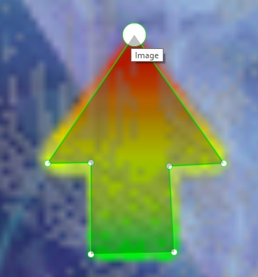

# Instructions to build the arrow detection model

## Place your raw image data to annotate in raw_data folder

- Don't worry about the naming of the images just as long as they are in that folder
- Don't rename any files yourself or things could break
- Make sure all the files are png files ending in .png

## Open the terminal and install requirements

Create a new conda environment

`conda create -n arrow python=3.10`

`conda activate arrow`

`pip install -r requirements.txt`

## Second annotate your data (start with doing 10) by entering this into the terminal and hitting enter:

- `labelme`(a new program will open, use it maximized for best results)
- hit open dir and open the raw_data folder
- also make sure to save into the raw_data folder once done labelling each image (a json will be created)

## Start annotating (label each arrow as "arrow")

From my experience it's better to have a few images but very well annotated than many that were not annotated well

### Tips

- Only use images with all 4 arrows (annotate all 4 arrows)
- Zoom in to the maximum amount until you start seeing individual pixels
- Click create polygons and click along the inside of the arrow
- Example below:

## Once finished annotating:

- Confirm that you have both the image files and the newly created .json of each image in the raw_data folder
- Run: `python -m rename` (this will rename the files as needed)
- Run: `python -m move` (this will move the files into the dataset folder)
- Run: `python -m train` (this will use the annotations to train a model)
- Run: `python -m test` (make sure you have a file called test.png to run it on)

## Tinker with the settings:

- Try out different .pth file that were created during the training to see what the difference is
